# Explication détaillée - `name_convention.vbs`

---

## Objectif de la macro

Cette macro vérifie que **chaque composant d'un fichier CATIA respecte une convention de nommage définie**. Elle s'applique aussi bien à une pièce seule (`.CATPart`) qu'à un assemblage complet (`.CATProduct`), en parcourant tous ses sous-composants de manière récursive.

La convention attendue est de la forme :

```
KVScode_CADTYPE_PDA_VERSION_DESCRIPTION
Exemples valides   : 5FF821105H_PCA_TM_5_FENDER_PHEV
Exemples invalides : Part1 / PartBody / fender_phev / 5FF821105H_XX_5
```

| Segment | Règle | Exemple |
|---|---|---|
| **KVS code** | 3 alphanum + 6 chiffres + 1 alphanum | `5FF821105H` |
| **CAD type** | `DMU` \| `PCA` \| `GEO` \| `VEE` | `PCA` |
| **PDA** | `TM` (officiel) \| `EN` (proposition) | `TM` |
| **Version** | Chiffre(s) | `5` |
| **Description** | Majuscules + chiffres + `_` | `FENDER_PHEV` |

---

## Déroulement global — étape par étape

### Étape 1 — `CATMain()` : point d'entrée

1. **Récupère le document actif** dans la session CATIA.
2. **Vide la sélection** courante (pour que seuls les éléments non conformes soient surlignés à la fin).
3. **Compile une instance RegExp unique** avec le motif complet.
4. **Détermine le type de document** :
   - **CATPart** → vérifie le nom racine de la pièce + chaque Corps (`Bodies`) + chaque Ensemble géométrique (`HybridBodies`) de façon récursive.
   - **CATProduct** → lance `ScanProduct` récursivement sur tout l'arbre d'assemblage.
   - **Autre format** → affiche un message d'erreur et s'arrête.
5. **Affiche le rapport final** avec le compte des non-conformités et leur emplacement complet dans l'arbre.

---

### Étape 2 — `ScanProduct()` : parcours récursif CATProduct

```
Pour chaque composant (prod) :
    1. Tester son PartNumber contre le motif regex
    2. Si non conforme → AddError + sélection dans CATIA
    3. Pour chaque sous-composant → appel récursif ScanProduct
```

Le chemin complet (`treePath`) est construit au fil de la récursion : `Racine > Sous-assy > Pièce`.

---

### Étape 3 — `ScanHybridBodies()` : parcours récursif des Ensembles géométriques

Même principe : pour chaque `HybridBody`, teste son nom, descend dans ses sous-ensembles imbriqués.

---

### Étape 4 — Rapport final

- ✅ **Aucune anomalie** → message de succès.
- ❌ **Anomalies détectées** → rappel de la convention + nombre d'éléments non conformes + liste avec emplacement complet dans l'arbre + surlignage dans CATIA.

---

## Motif de validation (Regex)

```
^[A-Z0-9]{3}\d{6}[A-Z0-9]_(DMU|PCA|GEO|VEE)_(TM|EN)_\d+_[A-Z][A-Z0-9_]*$
```

| Segment | Motif | Signification |
|---|---|---|
| KVS code | `[A-Z0-9]{3}\d{6}[A-Z0-9]` | 3 alphanum + 6 chiffres + 1 alphanum |
| Séparateur | `_` | Underscore obligatoire |
| CAD type | `(DMU\|PCA\|GEO\|VEE)` | Valeur exacte parmi la liste |
| PDA | `(TM\|EN)` | Statut officiel ou proposition |
| Version | `\d+` | Un ou plusieurs chiffres |
| Description | `[A-Z][A-Z0-9_]*` | Commence par une majuscule, alphanum + `_` |

La comparaison est **sensible à la casse** (`IgnoreCase = False`).

---

## Arbre des causes racines — Non-conformité de nommage

```mermaid
graph TD
    EFFECT["⚠️ Non-conformité de nommage<br/>Défaut qualité données CATIA"]

    EFFECT --> DC1["🔷 Nommage Corps & Features<br/>(CATPart — Part root + Bodies)"]
    EFFECT --> DC2["🔷 Nommage Composants<br/>(CATProduct — PartNumbers)"]
    EFFECT --> DC3["🔷 Nommage Ensembles<br/>Géométriques (HybridBodies)"]

    DC1 --> RC1["Nom par défaut CATIA<br/>(PartBody, Body.2)"]
    DC1 --> RC2["Code KVS absent<br/>ou mal formé"]
    DC1 --> RC3["Type CAD absent / invalide<br/>(≠ DMU · PCA · GEO · VEE)"]
    DC1 --> RC4["Statut PDA manquant<br/>(≠ TM · EN)"]
    DC1 --> RC5["Numéro de version absent<br/>ou non numérique"]
    DC1 --> RC6["Description non conforme<br/>(minuscules / caractères spéciaux)"]

    DC2 --> RC7["PartNumber générique<br/>(Part1, Product1)"]
    DC2 --> RC8["Sous-composants non contrôlés<br/>(arbre non parcouru sans macro)"]

    DC3 --> RC9["Ensemble géom. nommé par défaut<br/>(Geometrical Set.1)"]
    DC3 --> RC10["Sous-ensembles imbriqués<br/>non vérifiés"]

    style EFFECT fill:#6c3483,color:#fff,stroke:#512e5f
    style DC1 fill:#1a5276,color:#fff,stroke:#154360
    style DC2 fill:#1a5276,color:#fff,stroke:#154360
    style DC3 fill:#1a5276,color:#fff,stroke:#154360
    style RC1 fill:#1e8449,color:#fff,stroke:#196f3d
    style RC2 fill:#1e8449,color:#fff,stroke:#196f3d
    style RC3 fill:#1e8449,color:#fff,stroke:#196f3d
    style RC4 fill:#1e8449,color:#fff,stroke:#196f3d
    style RC5 fill:#1e8449,color:#fff,stroke:#196f3d
    style RC6 fill:#1e8449,color:#fff,stroke:#196f3d
    style RC7 fill:#1e8449,color:#fff,stroke:#196f3d
    style RC8 fill:#1e8449,color:#fff,stroke:#196f3d
    style RC9 fill:#1e8449,color:#fff,stroke:#196f3d
    style RC10 fill:#1e8449,color:#fff,stroke:#196f3d
```



---

## Remarques importantes
