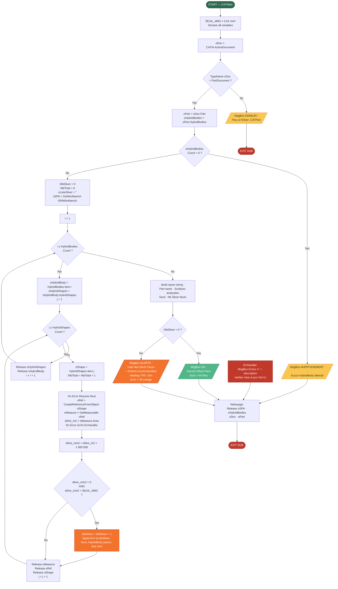

# Flowchart — silver_faces.vbs (DetectSliverFaces)

```mermaid
flowchart TD
    A([START — CATMain]) --> B[SEUIL_MM2 = 0.01 mm²\nDeclare all variables]
    B --> C[oDoc = CATIA.ActiveDocument]
    C --> D{TypeName oDoc\n= PartDocument ?}

    D -- No --> E[/MsgBox ERREUR :\nPas un fichier .CATPart/]
    E --> Z([EXIT SUB])

    D -- Yes --> F[oPart = oDoc.Part\noHybridBodies = oPart.HybridBodies]
    F --> G{oHybridBodies\n.Count = 0 ?}

    G -- Yes --> H[/MsgBox AVERTISSEMENT :\nAucun HybridBody détecté/]
    H --> CLEAN

    G -- No --> I[iNbSliver = 0\niNbTotal = 0\nsListeSliver = ''\noSPA = GetWorkbench SPAWorkbench]

    I --> J[i = 1]
    J --> K{i ≤ HybridBodies\n.Count ?}

    K -- No --> RPT

    K -- Yes --> L[oHybridBody = HybridBodies.Item i\noHybridShapes = oHybridBody.HybridShapes\nj = 1]

    L --> M{j ≤ HybridShapes\n.Count ?}

    M -- No --> N[Release oHybridShapes\nRelease oHybridBody\ni = i + 1]
    N --> K

    M -- Yes --> O[oShape = HybridShapes.Item j\niNbTotal = iNbTotal + 1]

    O --> P[On Error Resume Next\noRef = CreateReferenceFromObject oShape\noMeasure = GetMeasurable oRef\ndAire_m2 = oMeasure.Area\nOn Error GoTo ErrHandler]

    P --> Q[dAire_mm2 = dAire_m2 × 1 000 000]

    Q --> R{dAire_mm2 > 0\nAND\ndAire_mm2 < SEUIL_MM2 ?}

    R -- Yes --> S[iNbSliver = iNbSliver + 1\nAppend to sListeSliver :\nNom, HybridBody parent, Aire mm²]
    S --> T

    R -- No --> T[Release oMeasure\nRelease oRef\nRelease oShape\nj = j + 1]
    T --> M

    RPT[Build report string :\nPart name · Surfaces analysées\nSeuil · Nb Sliver faces]
    RPT --> U{iNbSliver = 0 ?}

    U -- Yes --> V[/MsgBox OK :\nAucune Sliver Face\niIcon = 64 bleu/]
    V --> CLEAN

    U -- No --> W[/MsgBox ALERTE :\nListe des Sliver Faces\n+ Actions recommandées\nHealing / Fill / Join\niIcon = 48 orange/]
    W --> CLEAN

    CLEAN[Nettoyage:\nRelease oSPA · oHybridBodies\noDoc · oPart]
    CLEAN --> Z2([EXIT SUB])

    ERR[ErrHandler:\nMsgBox Erreur n° + description\nVerifier mise à jour Ctrl+U]
    ERR --> CLEAN

    style A    fill:#2d6a4f,color:#fff,stroke:#1b4332
    style Z    fill:#c0392b,color:#fff,stroke:#922b21
    style Z2   fill:#c0392b,color:#fff,stroke:#922b21
    style E    fill:#f9c74f,stroke:#f3722c
    style H    fill:#f9c74f,stroke:#f3722c
    style V    fill:#52b788,color:#fff,stroke:#2d6a4f
    style W    fill:#f3722c,color:#fff,stroke:#ae2012
    style ERR  fill:#c0392b,color:#fff,stroke:#922b21
    style S    fill:#f3722c,color:#fff,stroke:#ae2012
```
