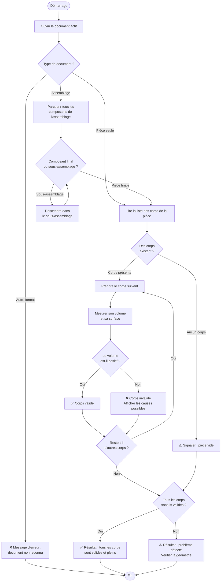

# Vérification Solide — Organigramme

```mermaid
flowchart TD
    A([Démarrage]) --> B[Ouvrir le document actif]
    B --> C{Type de document ?}

    C -->|Pièce seule| D[Lire la liste des corps de la pièce]
    C -->|Assemblage| E[Parcourir tous les\ncomposants de l'assemblage]
    C -->|Autre format| F[❌ Message d'erreur :\ndocument non reconnu]

    E --> G{Composant final\nou sous-assemblage ?}
    G -->|Sous-assemblage| H[Descendre dans\nle sous-assemblage]
    H --> G
    G -->|Pièce finale| D

    D --> I{Des corps\nexistent ?}
    I -->|Aucun corps| J[⚠️ Signaler : pièce vide]
    I -->|Corps présents| K[Prendre le corps suivant]

    K --> L[Mesurer son volume\net sa surface]
    L --> M{Le volume\nest-il positif ?}

    M -->|Oui| N[✅ Corps valide]
    M -->|Non| O[❌ Corps invalide\nAfficher les causes possibles]

    N --> P{Reste-t-il\nd'autres corps ?}
    O --> P
    P -->|Oui| K
    P -->|Non| Q{Tous les corps\nsont-ils valides ?}

    J --> Q
    F --> R([Fin])

    Q -->|Oui| S[✅ Résultat : tous les corps\nsont solides et pleins]
    Q -->|Non| T[⚠️ Résultat : problème détecté\nVérifier la géométrie]

    S --> R
    T --> R
```
